# Лабораторные работы по дисциплине Теория информационных процессов и систем

  
Список заданий

  <ol>
    <li><a href="#введение-в-qt-и-создание-простого-окна">Введение в Qt и создание простого окна</a></li>
    <li><a href="#сигналы-и-слоты">Сигналы и слоты</a></li>
    <li><a href="#работа-с-формами-и-компоновкой-виджетов">Работа с формами и компоновкой виджетов</a></li>
    <li><a href="#обработка-событий-мыши-и-клавиатуры">Обработка событий мыши и клавиатуры</a></li>
    <li><a href="#создание-простого-калькулятора">Создание простого калькулятора</a></li>
    <li><a href="#приложение-для-конвертации-валют">Приложение для конвертации валют</a></li>
    <li><a href="#создание-графического-текстового-редактора">Создание графического текстового редактора</a></li>
    <li><a href="#мини-приложение-для-заметок">Мини-приложение для заметок</a></li>
  </ol>

# Введение в Qt и создание простого окна
### Цель:
Познакомиться с основами разработки на Qt и созданием базового окна.
### Задачи:
- [x] Установить Qt Creator и подготовить проект.
- [x] Создать окно с минимальным интерфейсом.
### Скриншоты:
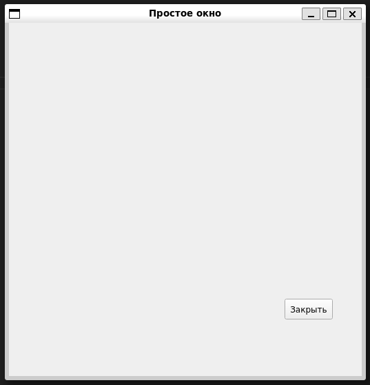

### Код приложения:
[main.cpp](https://github.com/rrraumpanzer/introduction-to-qt-tasks/blob/main/task1/main.cpp)

# Сигналы и слоты
### Цель:
Изучить концепцию сигналов и слотов, которые являются основным механизмом связи между элементами в Qt.
### Задачи:
- [x] Создать интерфейс с кнопками и метками.
- [x] Использовать сигналы и слоты для взаимодействия элементов.
### Скриншоты:
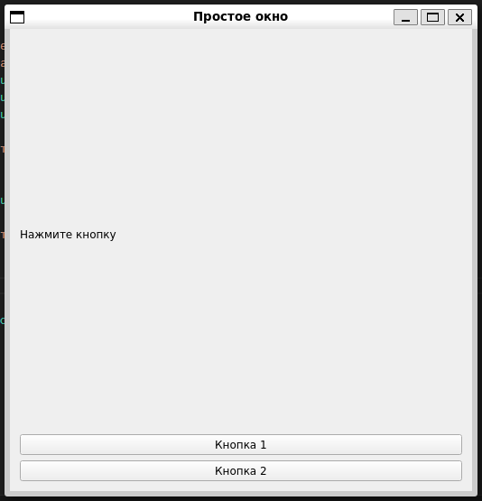
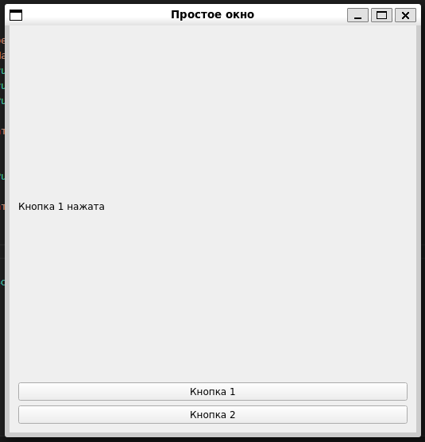
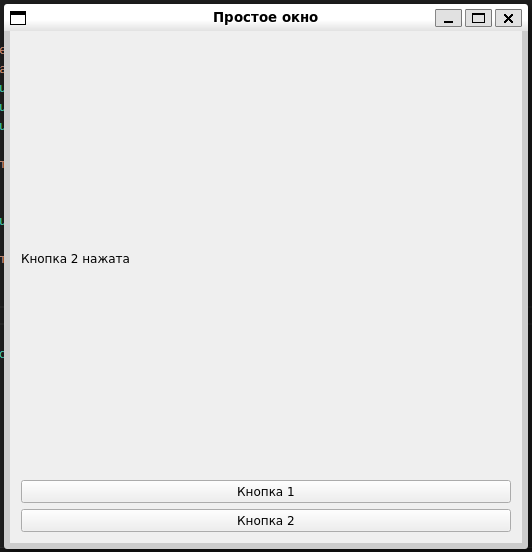

### Код приложения:
[main.cpp](https://github.com/rrraumpanzer/introduction-to-qt-tasks/blob/main/task2/main.cpp)

# Работа с формами и компоновкой виджетов
### Цель:
Изучить слои компоновки для организации элементов интерфейса.
### Задачи:
- [x] Использовать различные компоновки для упорядочивания виджетов.
- [x] Создать форму с гибким расположением элементов.
### Скриншоты:
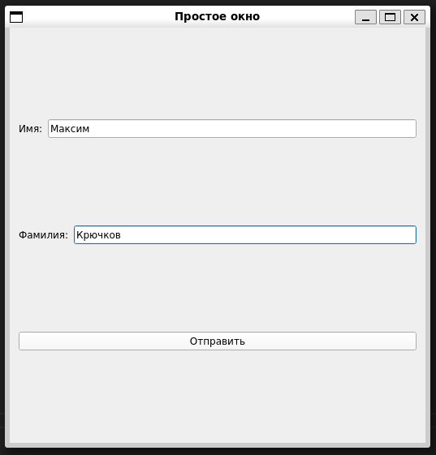

### Код приложения:
[main.cpp](https://github.com/rrraumpanzer/introduction-to-qt-tasks/blob/main/task3/main.cpp)

# Обработка событий мыши и клавиатуры
### Цель:
Изучить обработку пользовательских событий: нажатие клавиш и клики мышью.
### Задачи:
- [x] Реализовать обработку нажатия клавиш и мыши.
- [x] Создать программу, изменяющую поведение при взаимодействии с пользователем.
### Скриншоты:
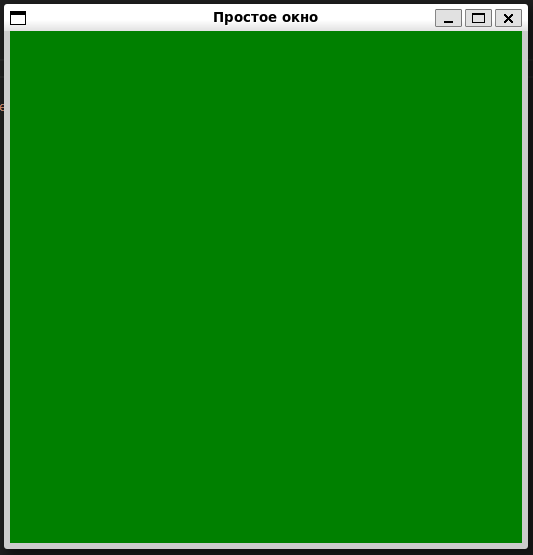
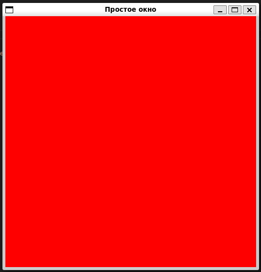

### Код приложения:
[main.cpp](https://github.com/rrraumpanzer/introduction-to-qt-tasks/blob/main/task4/main.cpp)

[CustomWidget.cpp](https://github.com/rrraumpanzer/introduction-to-qt-tasks/blob/main/task4/CustomWidget.cpp)

# Создание простого калькулятора
### Цель:
Разработать базовое приложение для выполнения арифметических операций.
### Задачи:
- [x] Создать интерфейс с кнопками для цифр и операций.
- [x] Реализовать логику выполнения арифметических операций.
### Скриншоты:
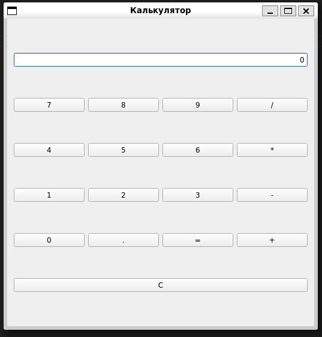
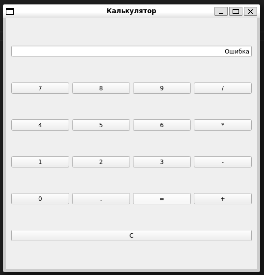
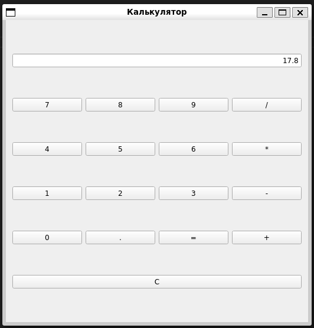

### Код приложения:
[main.cpp](https://github.com/rrraumpanzer/introduction-to-qt-tasks/blob/main/task5/main.cpp)

[CustomWidget.cpp](https://github.com/rrraumpanzer/introduction-to-qt-tasks/blob/main/task5/CalculatorWidget.cpp)

# Приложение для конвертации валют
### Цель:
Разработать мини-приложение для конвертации валют.
### Задачи:
- [x] Создать интерфейс для ввода суммы и выбора валюты.
- [x] Реализовать функционал конвертации с использованием фиксированных курсов.
### Скриншоты:
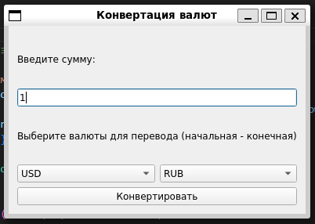
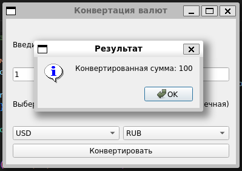
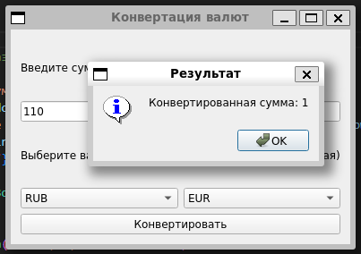

### Код приложения:
[main.cpp](https://github.com/rrraumpanzer/introduction-to-qt-tasks/blob/main/task6/main.cpp)

# Создание графического текстового редактора
### Цель:
Разработать текстовый редактор с базовыми функциями открытия, сохранения и редактирования файлов.
### Задачи:
- [x] Создать интерфейс с полем для редактирования текста.
- [x] Реализовать функции для работы с файлами.
### Скриншоты:
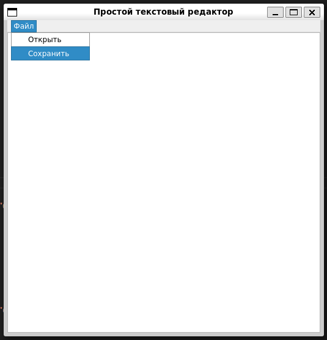
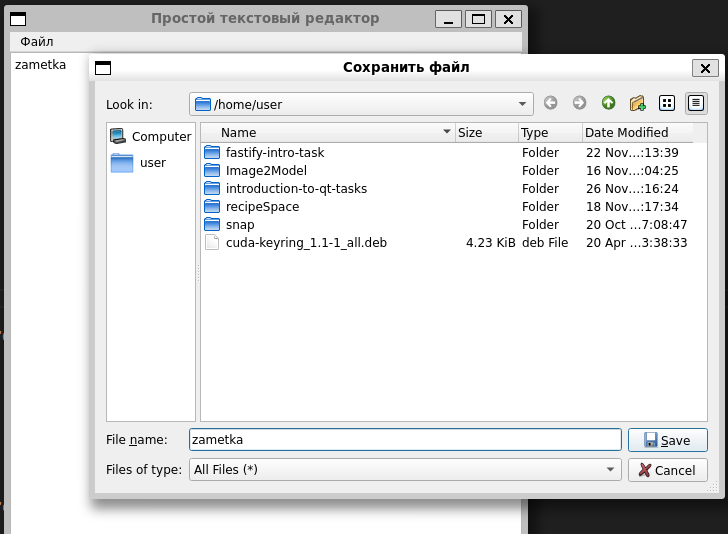
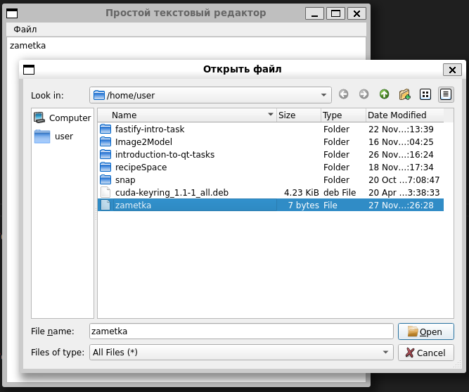

### Код приложения:
[main.cpp](https://github.com/rrraumpanzer/introduction-to-qt-tasks/blob/main/task7/main.cpp)

# Мини-приложение для заметок
### Цель:
Создать приложение для хранения и редактирования заметок с возможностью сохранения на локальном диске.
### Задачи:
- [x] Создать интерфейс для работы с заметками.
- [x] Реализовать сохранение и загрузку заметок.
### Скриншоты:
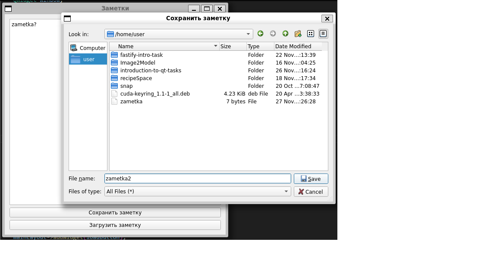
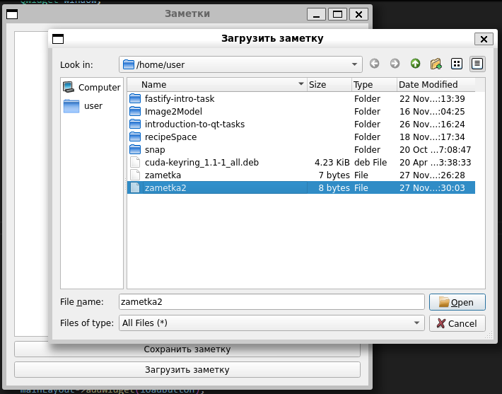
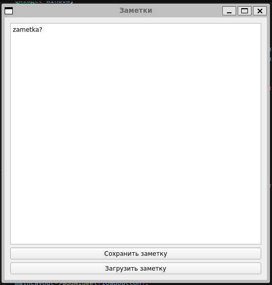

### Код приложения:
[main.cpp](https://github.com/rrraumpanzer/introduction-to-qt-tasks/blob/main/task8/main.cpp)

